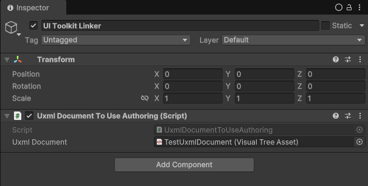

# MiniUI


## Initialization

Add an empty GameObject with ```UxmlDocumentToUseAuthoring``` to your SubScene



## Usage

### UIScreens

- UIScreen

```csharp
using MiniUI.UIScreens;
using UnityEngine.UIElements;

public class MainMenuScreen : UIScreen
{
    // Auto-injection
    public Button PlayButton;
    public SettingsScreen SettingsScreen;
    
    // Called every time a new not processed UxmlDocumentToUse appears
    public override void TryUpdateScreenData(VisualElement root)
    {
        // Can be null
        PlayButton = root.Q<Button>("play-button"); 
    }
}

public class SettingsScreen : UIScreen
{
    /*
     * Here Data of SettingsScreen
     */
    
    public override void TryUpdateScreenData(VisualElement root)
    {
        /*
         * Getting UIElements
         */
    }
}
```

- Screens

```csharp
var screen1 = (HUDScreen) Screens.Instance.Get(typeof(HUDScreen));
var screen2 = (SettingsScreen) Screens.Instance.Get<SettingsScreen>();
```

### Operators

- IOperator, IEcbOperator, IEntityOperator<>, IEntityDataOperator<>

```csharp
using MiniUI.Operators;
using MiniUI.UIScreens;
using Unity.Entities;
using Unity.Mathematics;
using UnityEngine.UIElements;

public class HUDOperator : 
        IEntityDataOperator<JoystickDirection>, 
        IEntityOperator<HUDOperator.JumpButtonWaspPressedMarker>
{
    private Button _jumpButton;
    private JoystickArea _joystickArea;

    EntityCommandBuffer IEcbOperator.ECB { get; set; }

    Entity IEntityDataOperator<JoystickDirection>.Entity { get; set; }
    
    Entity IEntityOperator<JumpButtonWaspPressedMarker>.Entity { get; set; }
    
    // Called every time a new not processed UxmlDocumentToUse appears
    public void Initialize()
    {
        var screen = (HUDScreen) Screens.Instance.Get(typeof(HUDScreen));

        if (screen.JumpButton == null &&
            screen.JoystickArea == null)
        {
            return;
        }

        _jumpButton = screen.JumpButton;
        _joystickArea = screen.JoystickArea;
    }
    
    // Called every time a new not processed UxmlDocumentToUse appears
    public void Subscribe()
    {
        _jumpButton.clicked += OnJumpButtonClicked;
        _joystickArea.OnJoystickInputChanged += OnJoystickDirectionChanged;
    }
    
    private void OnJumpButtonClicked()
    {
        var ecb = ((IEcbOperator)this).ECB;
        var entity = ((IEntityOperator<JumpButtonWaspPressedMarker>)this).Entity;
        
        ecb.AddComponent<JumpButtonWaspPressedEvent>(entity);
    }

    private void OnJoystickDirectionChanged(float2 direction)
    {
        var ecb = ((IEcbOperator)this).ECB;
        var entity = ((IEntityDataOperator<JoystickDirection>)this).Entity;
        
        ecb.SetComponent(entity, new JoystickDirection
        {
            Value = direction
        });
    }
    
    // Marker class that allows you to implement multiple interfaces
    public class JumpButtonWaspPressedMarker : IMarker { }
}
```

> [!IMPORTANT]
> If you use IEntityDataOperator<> with enableable components, they will be disabled immediately when you add an entity

### Listeners

- IListener, IDataListener<>, IEventListener<>, IMarkableDataListener<,>

```csharp
using MiniUI.Listeners;
using MiniUI.UIScreens;
using Scenes.UI.Joystick;
using Unity.Entities;
using UnityEngine;
using UnityEngine.UIElements;

public class HUDListener : 
        IMarkableDataListener<Ammo, CurrentPlayerWeaponTag>, 
        IDataListener<MatchTimer>, 
        IEventListener<JumpButtonWasPressedEvent>
{
    private Label _matchTimerLabel;
    private Label _ammoCountLabel;
    private Button _jumpButton; 
    
    // Called every time a new not processed UxmlDocumentToUse appears
    public void Initialize()
    {
        var screen = (HUDScreen)Screens.Instance.Get(typeof(HUDScreen));

        if (screen.MatchTimerLabel == null &&
            screen.AmmoCountLabel == null && 
            screen.JoystickArea == null)
        {
            return;
        }
        
        _matchTimerLabel = screen.MatchTimerLabel;
        _ammoCountLabel = screen.AmmoCountLabel;
        _jumpButton = screen.JumpButton;
    }
    
    // Called when the data of a component that has the corresponding component-tag is changed
    public void OnDataChanged(Ammo ammo)
    {
        _ammoCountLabel.text = ammo.Value.ToString();
    }
    
    // Called when the data of a component is changed
    public void OnDataChanged(MatchTimer timer)
    {
        _matchTimerLabel.text = timer.GetMinutes() + ":" + timer.GetSeconds();
    }
    
    // Called when a component of a type is added or enabled in the ecs world
    public void OnHasEvent(JumpButtonWasPressedEvent evnt)
    {
        _jumpButton.style.backgroundImage = Resources.Load<Texture2D>("PressedJumpButton");
    }
}
```

> [!IMPORTANT]
> If the component you are listening to via IEventListener<> is a enableable component, then it will only work when it is enabled
